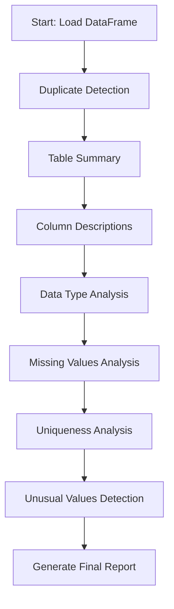

# Design Doc: Data Profiling Tool

> Please DON'T remove notes for AI

## Requirements

> Notes for AI: Keep it simple and clear.
> If the requirements are abstract, write concrete user stories

**Problem**: Users need to understand their pandas DataFrame data quality and characteristics before analysis or modeling.

**User Stories**:
- As a data scientist, I want to automatically detect duplicate rows so I can decide whether to remove them
- As an analyst, I want a high-level summary of my table to understand what the data represents
- As a data engineer, I want detailed column descriptions to understand each field's meaning
- As a developer, I want to identify correct data types for proper processing
- As a researcher, I want to find missing values and understand if they're meaningful or problematic
- As a quality analyst, I want to identify unique columns that could serve as identifiers
- As a data validator, I want to detect unusual/outlier values that may indicate data quality issues

## Flow Design

> Notes for AI:
> 1. Consider the design patterns of agent, map-reduce, rag, and workflow. Apply them if they fit.
> 2. Present a concise, high-level description of the workflow.

### Applicable Design Pattern:

1. **Workflow**: Sequential processing pipeline where each step builds upon previous analysis
2. **Batch**: Some nodes (like column analysis) process multiple columns in parallel for efficiency

### Flow High-level Design:

1. **Duplicate Detection Node**: Analyzes the DataFrame for duplicate rows and provides statistics
2. **Table Summary Node**: Creates a high-level description of what the table represents
3. **Column Description Node**: Analyzes each column to provide meaningful descriptions and suggest better names
4. **Data Type Analysis Node**: Determines appropriate data types for each column
5. **Missing Values Analysis Node**: Identifies missing values and categorizes them as meaningful vs problematic
6. **Uniqueness Analysis Node**: Identifies columns that could serve as unique identifiers
7. **Unusual Values Detection Node**: Detects outliers and anomalous values in each column



## Utility Functions

> Notes for AI:
> 1. Understand the utility function definition thoroughly by reviewing the doc.
> 2. Include only the necessary utility functions, based on nodes in the flow.

1. **Call LLM** (`utils/call_llm.py`)
   - *Input*: prompt (str)
   - *Output*: response (str)
   - Used by all analysis nodes for intelligent data interpretation

## Node Design

### Shared Store

> Notes for AI: Try to minimize data redundancy

The shared store structure is organized as follows:

```python
shared = {
    "dataframe": pd.DataFrame,          # Original DataFrame
    "sample_data": str,                 # CSV sample for LLM analysis
    "profile_results": {
        "duplicates": {
            "count": int,
            "percentage": float,
            "sample_rows": str
        },
        "table_summary": str,
        "column_descriptions": {
            "col_name": {
                "description": str,
                "suggested_name": str
            }
        },
        "data_types": {
            "col_name": {
                "current_type": str,
                "suggested_type": str,
                "confidence": float
            }
        },
        "missing_values": {
            "col_name": {
                "count": int,
                "percentage": float,
                "likely_meaningful": bool,
                "reason": str
            }
        },
        "uniqueness": {
            "col_name": {
                "unique_count": int,
                "unique_percentage": float,
                "is_candidate_key": bool
            }
        },
        "unusual_values": {
            "col_name": {
                "has_unusual": bool,
                "unusual_samples": list,
                "explanation": str
            }
        }
    },
    "final_report": str                 # Comprehensive profiling report
}
```

### Node Steps

> Notes for AI: Carefully decide whether to use Batch/Async Node/Flow.

1. **Duplicate Detection Node**
   - *Purpose*: Detect and analyze duplicate rows in the DataFrame
   - *Type*: Regular Node
   - *Steps*:
     - *prep*: Read "dataframe" from shared store and create sample
     - *exec*: Call LLM to analyze duplicate patterns and significance
     - *post*: Write duplicate analysis to "profile_results.duplicates"

2. **Table Summary Node**
   - *Purpose*: Generate high-level description of the table's purpose and content
   - *Type*: Regular Node
   - *Steps*:
     - *prep*: Read "dataframe" sample and column names from shared store
     - *exec*: Call LLM to generate comprehensive table summary
     - *post*: Write summary to "profile_results.table_summary"

3. **Column Description Node**
   - *Purpose*: Analyze each column to provide descriptions and name suggestions
   - *Type*: Batch Node (processes columns in chunks)
   - *Steps*:
     - *prep*: Return list of column chunks for parallel processing
     - *exec*: Call LLM to analyze each column chunk for descriptions
     - *post*: Combine results and write to "profile_results.column_descriptions"

4. **Data Type Analysis Node**
   - *Purpose*: Determine appropriate data types for each column
   - *Type*: Regular Node
   - *Steps*:
     - *prep*: Read "dataframe" and column info from shared store
     - *exec*: Call LLM to analyze data types with sample data
     - *post*: Write type analysis to "profile_results.data_types"

5. **Missing Values Analysis Node**
   - *Purpose*: Analyze missing values to determine if they're meaningful or problematic
   - *Type*: Regular Node
   - *Steps*:
     - *prep*: Read "dataframe" and calculate missing value statistics
     - *exec*: Call LLM to determine if missing values are meaningful
     - *post*: Write missing value analysis to "profile_results.missing_values"

6. **Uniqueness Analysis Node**
   - *Purpose*: Identify columns that could serve as unique identifiers
   - *Type*: Regular Node
   - *Steps*:
     - *prep*: Read "dataframe" and calculate uniqueness statistics
     - *exec*: Call LLM to determine candidate key columns
     - *post*: Write uniqueness analysis to "profile_results.uniqueness"

7. **Unusual Values Detection Node**
   - *Purpose*: Detect outliers and anomalous values in columns
   - *Type*: Batch Node (processes columns individually)
   - *Steps*:
     - *prep*: Return list of columns to analyze for unusual values
     - *exec*: Call LLM to analyze each column's value patterns
     - *post*: Write unusual value findings to "profile_results.unusual_values"

